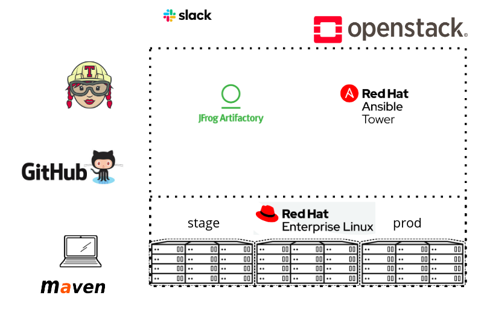

# ansible-demo-app

[](https://travis-ci.org/andyneeb/ansible-demo-app)

A simple Java Hello World written primarily to showcase Red Hat Ansible Tower.

# Overview

Ansible Tower is - among other things - an API to make Ansible playbooks easily consumable and therefore foster collaboration and reuse of playbooks / roles / modules.

This demo has been created to demonstrate how Ansible Tower can easily be integrated into a typical enterprise toolchain. My environment currently uses the following building blocks. Those are mere examples and should easily be replaceable by the usual suspects (ie. Github -> Gitlab, Travis -> Jenkins, Artifactory -> Nexus, Slack -> Mattermost ...).

- Red Hat OpenStack 13 (Queens): IaaS layer providing compute, network, storage and loadbalancer
- Github (this repo): SCM for code, playbooks, config, pipeline definition
- Artifactory: Repository for packaged binaries (single war in this case)
- Travis CI: Continuous Integration / Build system
- Slack: Notifaction on build & deployment status
- Red hat Ansible Tower: Automated provisioning & teardown of test env, deployment, release management, security, role based access

Below is a diagram of the main components.



# High Level Demo Flow

- Checkout branch / make modifications / push branch to origin
- Create PR (your branch -> master)
- Push on any branch !=master will trigger test pipeline
- CI server runs build, unit test, code coverage, package, pushes artifacts (tagged with current dev branch) to repo
- On success CI server triggers workflow in Ansible Tower
- Tower creates test environment: single rhel7 system, add to loadbalancer, subscribe, install java & tomcat
- Tower will then deploy artefact (war) to test env and do smoke test
- On success PR can be merged
- Merge to master will trigger prod pipeline
- CI server again runs build, all test, pushes artifacts (now tagged with current commit id) to repo
- On success CI server triggers Ansible Tower
- Tower will create new release job pointing to current artifacts and rotate previous release to N-1 for possible rollback
- Tower will setup role based access to release job
- Tower will configure slack notifications
- Release manager will eventually log into Tower and push current to production using encrypted SSH keys and password

# Repo structure / available assets

### Directory layout

    .
    ├── .travis                   
    │   ├── release.sh              # Release script
    │   ├── settings.xml            # Maven settings
    │   └── stage.sh                # Staging script
    ├── images                    # Embedded images for readme / docs
    ├── plays                     
    │   ├── roles                   # Ansible roles
    │   │   └── requirements.yml      # Requirements definition (tomcat)
    │   └── simple.yml              # Playbook (app + tomcat)
    ├── src/main/webapp           # Source files
    ├── tower                     # Tower objects (jobs, workflows, etc.)
    ├── .travis.yml               # Travis-CI pipeline definition
    ├── README.md                 # This file
    └── pom.xml                   # Maven project definition

### Setup Instructions / Customizations
To run this demo you will at minimum need:
- Programable IaaS layer that can provide compute/storage/network and ingrees routing / load balancer. All my playbooks asume an OpenStack API (Queens tested, newer *should* work)
- A maven repository (Nexus / Artifactory / ...). I provide a simple playbook to setup Artifactory at https://github.com/andyneeb/ansible-demo-infra/blob/master/artifactory.yml
- Ansible Tower instance. A playbook & roles to provision Tower on OpenStack together with instructions is available at https://github.com/ktenzer/ansible-tower-on-openstack-123
- If you don't use Travis-CI you need to build your own pipeline files. Your mileage might vary.

Assuming you follow my setup, here is what you need to do:

1.) Set the following variables on your travis build (in web ui)
- REPO_URL: Repository URL (Artifactory / Nexus / ...)
- REPO_USER: User for your repository
- REPO_PASSWORD: Password for your repository
- PYTHONWARNINGS: Set to IGNORE to prevent python deprecation warnings clutter build logs
- TOWER_URL: Tower instance URL
- TOWER_USER: Tower user
- TOWER_PASSWORD: Tower password

2.) Also in build setting in Travis Web UI disable 'Build pushed pull requests'. No need to start another build on PR for demo.

3.) Configure your repository URL in .travis/settings.xml. (Will make this a var in a future version)

4.) Setup project for required playbooks in Tower. Everything is available at https://github.com/andyneeb/ansible-demo-infra but will need heavy customization if you are not running on OpenStack. If you do, you still need to set propper vars for your OpenStack environment.

5.) Import all tower objects from ./tower. Easiest way is to use tower-cli like this:

```
tower-cli send ./tower

